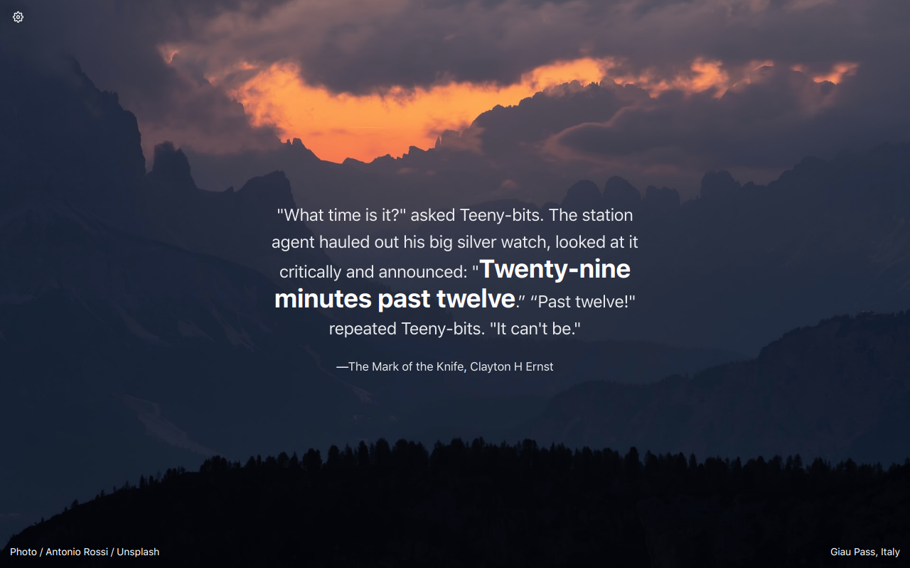

<h1 align="center">Tabliss</h1>

<p align="center">A beautiful, customisable New Tab page for Safari.</p>

<p align="center"><a href="https://github.com/joelshepherd/tabliss">Tabliss original repository</a></p>



<p align="center"><a href="https://tabliss.io">https://tabliss.io</a></p>

## Usage

clone this repository:

```bash
git clone https://github.com/Anoerak/Tabliss_Safari_Extension.git
```

Open the folder project  in Xcode.

Build the prject (⌘ + B).

Run the project (⌘ + R).

Activate the developer menu in Safari by going to `Safari > Settings > Advanced` and checking the `Show Develop menu in menu bar` option.

Go to `Safari > Settings > Develop > Allow Unsigned Extensions`.

Go to `Develop > Show Extension Builder`.


## Translations

Checkout the guide to [adding translations](TRANSLATING.md).
